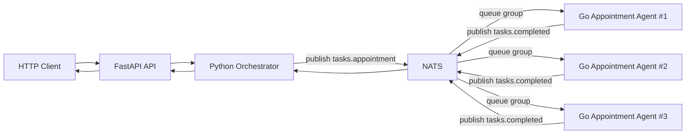

# Лабораторная работа № 13 Мультиагентные системы: разработка распределённых интеллектуальных агентов

**Студент:** Ражина Маргарита Александровна
**Группа:** 220032-11
**Вариант:** 18, система поддержки пациентов (Сложность: средняя)

## Агенты системы поддержки пациентов

| Тип агента | Роль в системе | Входные данные | Выходные данные | Бизнес-правила |
|---|---|---|---|---|
| **Агент записи к врачу** | Автоматизирует запись пациента к врачу | ФИО, дата рождения, контакт, специальность, желаемая дата и время, тип приёма | Подтверждение записи или ошибка | 1. Если слот свободен, запись создаётся.<br>2. Если слот занят, возвращается ошибка.<br>3. Запись возможна только на будущее время. |
| **Агент напоминания о приёме** | Отправляет напоминания пациенту | Дата и время приёма, контакт, тип напоминания, время отправки | Статус доставки, подтверждение или отмена | 1. Напоминания отправляются заранее.<br>2. При отсутствии подтверждения возможна повторная отправка.<br>3. При отмене слот освобождается. |
| **Агент сбора обратной связи** | Собирает отзывы после визита | Идентификатор приёма, дата визита, контакт, шаблон опроса | Оценка, отзыв, отчёт | 1. Опрос отправляется после приёма.<br>2. Анонимность поддерживается по запросу.<br>3. Низкая оценка инициирует эскалацию. |
| **Агент триажа** | Определяет срочность обращения | Симптомы, возраст, пол, хронические заболевания, температура, уровень боли, контакт | Приоритет, рекомендация, предварительный диагноз | 1. Критические симптомы требуют срочной реакции.<br>2. Дети и пожилые пациенты имеют повышенный приоритет.<br>3. Агент выдаёт рекомендации, а не окончательный диагноз. |


## Описание проекта

Проект реализует распределённую систему записи к врачу. REST API на FastAPI принимает HTTP-запрос, передаёт задачу в Python-оркестратор, оркестратор публикует её в NATS, а Go-агент записи к врачу обрабатывает задачу и возвращает результат обратно через брокер сообщений.

Система поддерживает:

- приём задач через HTTP;
- маршрутизацию задач через NATS;
- повторные попытки и таймауты в оркестраторе;
- запуск нескольких экземпляров одного Go-агента;
- балансировку нагрузки через NATS queue group;
- логирование и базовые метрики;
- unit-, API- и интеграционные тесты.

## Архитектура



## Компоненты системы

### API

Папка: `api/`

FastAPI-приложение принимает HTTP-запросы, валидирует входные данные, вызывает сервисный слой и преобразует результат оркестратора в HTTP-ответ с корректным кодом состояния.

### Оркестратор

Папка: `orchestrator/`

Оркестратор написан на Python с использованием `asyncio` и `nats-py`. Он публикует задачу в NATS, ожидает результат на `tasks.completed`, отслеживает таймауты, считает количество повторных попыток и возвращает унифицированный результат в API.

### Агент записи к врачу

Папка: `appointment-agent/`

Go-агент подписан на `tasks.appointment` через queue group `appointment-agents`, валидирует входные данные, проверяет доступность слота, бронирует слот и публикует результат обработки. Каждый экземпляр агента добавляет в результат `agent_id`, что позволяет наблюдать распределение нагрузки.

### NATS

NATS выступает транспортным слоем между оркестратором и агентами. Оркестратор отправляет задачи в subject `tasks.<type>`, а агенты публикуют завершённые результаты в `tasks.completed`.

### Общее хранилище слотов

Для корректной работы нескольких экземпляров агента используется файловое хранилище слотов. Оно разделяется между контейнерами через Docker volume, поэтому проверка уже занятых слотов работает не только внутри одного процесса, но и между репликами агента.


## Структура проекта

```text
lab13/
├── api/
│   ├── __init__.py
│   ├── dependencies.py      # Зависимости FastAPI и создание оркестратора
│   ├── Dockerfile           # Образ API-сервиса
│   ├── main.py              # FastAPI приложение и HTTP-эндпоинты
│   ├── models.py            # Pydantic модели запросов и ответов
│   ├── requirements.txt     # Зависимости API
│   └── services.py          # Сервисный слой для отправки задач в оркестратор
├── appointment-agent/
│   ├── .dockerignore        # Исключения для сборки Docker-образа агента
│   ├── Dockerfile           # Образ Go-агента
│   ├── entrypoint.sh        # Точка входа для Docker-контейнера агента
│   ├── go.mod               # Описание Go-модуля
│   ├── go.sum               # Зафиксированные Go-зависимости
│   ├── logger.go            # Логирование агента
│   ├── main.go              # Точка входа и подписка на NATS
│   ├── models.go            # Структуры задач и результатов
│   ├── processor.go         # Бизнес-логика записи к врачу
│   ├── processor_test.go    # Unit-тесты агента
│   ├── storage.go           # Общее файловое хранилище слотов
│   └── validator.go         # Валидация входных данных агента
├── orchestrator/
│   ├── __init__.py
│   ├── logger.py            # Логирование оркестратора
│   ├── metrics.py           # Метрики обработанных задач и retry
│   ├── models.py            # Модели задач и результатов
│   ├── orchestrator.py      # Публикация задач и ожидание ответов из NATS
│   └── requirements.txt     # Зависимости оркестратора
├── tests/
│   ├── __init__.py
│   ├── pytest.ini           # Конфигурация pytest для тестов
│   ├── requirements.txt     # Зависимости для тестов
│   ├── test_api.py          # Позитивные и негативные тесты REST API
│   ├── test_integration.py  # Интеграционные тесты связки API, оркестратора и агента
│   └── test_orchestrator_unit.py  # Unit-тесты оркестратора с моками NATS
├── .gitignore               # Исключения для Git
├── docker-compose.yml       # Локальная инфраструктура NATS, API и агента
├── PROMPT_LOG.md            # Лог промптов по заданиям лабораторной работы
├── pytest.ini               # Конфигурация pytest
└── README.md                # Документация по проекту
```

## Требования

Для запуска без Docker:

- Go 1.25+
- Python 3.12+
- Docker Desktop или локально установленный NATS, если нужен полный запуск

Для запуска с Docker:

- Docker
- Docker Compose

## Установка и запуск с Docker

### 1. Запуск базовой системы

```bash
docker compose up -d --build
```

После запуска будут доступны:

- API: `http://localhost:8000`
- NATS client port: `localhost:4222`
- NATS monitoring: `http://localhost:8222`

### 2. Остановка системы

```bash
docker compose down --remove-orphans
```

### 3. Запуск нескольких агентов для балансировки нагрузки

```bash
docker compose up -d --build --scale appointment-agent=3
```

## Установка и запуск без Docker

### 1. Запуск NATS

Если `nats-server` установлен локально:

```bash
nats-server -m 8222
```

Если локального NATS нет, можно запустить только брокер в Docker:

```bash
docker compose up -d nats
```

### 2. Запуск Go-агента

```bash
cd appointment-agent
go run .
```

Для Windows PowerShell:

```powershell
$env:NATS_URL = "nats://localhost:4222"
$env:SLOT_STORE_PATH = "data/slots.json"
go run .
```

### 3. Запуск FastAPI API

```bash
python -m pip install -r api/requirements.txt
uvicorn api.main:app --host 0.0.0.0 --port 8000
```

Для Windows PowerShell:

```powershell
$env:NATS_URL = "nats://localhost:4222"
$env:ORCHESTRATOR_TIMEOUT = "10"
$env:ORCHESTRATOR_MAX_RETRIES = "3"
python -m pip install -r api/requirements.txt
uvicorn api.main:app --host 0.0.0.0 --port 8000
```

## API

### GET /health

Проверка доступности API.

Пример ответа:

```json
{
	"status": "ok"
}
```

Коды состояния:

- `200 OK` — API работает.

### POST /tasks/appointment

Создаёт задачу на запись к врачу.

Пример запроса:

```json
{
	"full_name": "Иванов Иван Иванович",
	"birth_date": "1990-01-01",
	"contact": "ivan@example.com",
	"specialty": "Терапевт",
	"preferred_date_time": "2026-05-20T10:00:00Z",
	"type": "offline"
}
```

Пример успешного ответа:

```json
{
	"task_id": "ee4b1095-bb90-40ee-b9e0-b3a4f42157cc",
	"success": true,
	"output": {
		"date_time": "2026-05-20T10:00:00Z",
		"location": "Cabinet 25"
	},
	"agent_id": "50c6f7142342",
	"error": null
}
```

Пример бизнес-ошибки:

```json
{
	"detail": {
		"task_id": "task-id",
		"success": false,
		"output": "slot is already booked",
		"agent_id": "agent-2",
		"error": null
	}
}
```

Пример ошибки таймаута:

```json
{
	"detail": "task execution timed out"
}
```

Коды состояния:

- `200 OK` — задача успешно обработана;
- `400 Bad Request` — бизнес-ошибка, например занятый слот или некорректные данные по правилам агента;
- `422 Unprocessable Entity` — тело запроса не прошло валидацию FastAPI/Pydantic;
- `503 Service Unavailable` — API не может обратиться к оркестратору;
- `504 Gateway Timeout` — оркестратор не дождался ответа от агента.

### Пример запроса через curl

```bash
curl -X POST http://localhost:8000/tasks/appointment \
	-H "Content-Type: application/json" \
	-d '{
		"full_name": "Иванов Иван Иванович",
		"birth_date": "1990-01-01",
		"contact": "ivan@example.com",
		"specialty": "Терапевт",
		"preferred_date_time": "2026-05-20T10:00:00Z",
		"type": "offline"
	}'
```

### Пример запроса через PowerShell

```powershell
$body = @{
	full_name = "Иванов Иван Иванович"
	birth_date = "1990-01-01"
	contact = "ivan@example.com"
	specialty = "Терапевт"
	preferred_date_time = "2026-05-20T10:00:00Z"
	type = "offline"
} | ConvertTo-Json

Invoke-RestMethod -Uri http://localhost:8000/tasks/appointment \
	-Method Post \
	-ContentType "application/json" \
	-Body $body
```

## Тестирование

### Go unit tests

```bash
cd appointment-agent
go test ./...
```

Покрываются:

- успешная запись;
- отклонение даты в прошлом;
- отказ при повторном бронировании;
- общее файловое состояние между экземплярами хранилища.

### Python tests

Для API-тестов:

```bash
pytest tests/test_api.py -q
```

Для unit-тестов оркестратора и интеграционных тестов требуется поднятый NATS. Проще всего сделать это через Docker:

```bash
docker compose up -d nats
pytest tests/test_orchestrator_unit.py -q
pytest tests/test_integration.py -q
docker compose down --remove-orphans
```

Для полной проверки с балансировкой нагрузки:

```bash
docker compose up -d --build --scale appointment-agent=3
pytest tests/test_api.py -q
pytest tests/test_orchestrator_unit.py -q
pytest tests/test_integration.py -q
docker compose down --remove-orphans
```

## Логирование и мониторинг

- Go-агент пишет логи в консоль и в файл в папке `appointment-agent/logs/`;
- Python-оркестратор пишет логи в консоль и в папку `logs/`;
- в агенте и оркестраторе ведётся счётчик обработанных задач.

## Балансировка нагрузки

Балансировка реализована через queue group `appointment-agents` в NATS. Если запущено несколько экземпляров `appointment-agent`, задачи subject `tasks.appointment` распределяются между ними, а поле `agent_id` в результате показывает, какой экземпляр обработал конкретную задачу.
